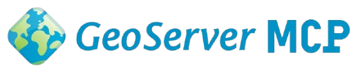

# GeoServer MCP Server

<!-- mcp-name: io.github.ronitjadhav/geoservercloud-mcp -->



**🌐 [geoservermcp.maplabs.tech](https://geoservermcp.maplabs.tech)**

An MCP server that wraps the [python-geoservercloud](https://github.com/camptocamp/python-geoservercloud) library, exposing 80+ GeoServer operations as natural-language tools for AI assistants like Claude, VS Code Copilot, and other MCP-compatible clients.

---

## Installation

### From PyPI

```bash
pip install geoservercloud-mcp
```

Or use `uvx` to run without installing (requires [uv](https://docs.astral.sh/uv/)):

```bash
# Install uv first (if not already installed)
curl -LsSf https://astral.sh/uv/install.sh | sh

# Run the MCP server
uvx geoservercloud-mcp
```

### From MCP Registry

This server is published to the [MCP Registry](https://registry.modelcontextprotocol.io) as:

```text
io.github.ronitjadhav/geoservercloud-mcp
```

---

## Connecting to AI Clients

### Claude Code

```bash
claude mcp add geoserver \
  --env GEOSERVER_URL=http://localhost:8080/geoserver \
  --env GEOSERVER_USER=admin \
  --env GEOSERVER_PASSWORD=geoserver \
  -- uvx geoservercloud-mcp
```

This adds it at the default _local_ (per-project) scope. Use `--scope user` to make
it available in all your projects, or `--scope project` to write it to a shared
`.mcp.json` committed in the repo. Omit the `--env` flags and the AI will ask for
the URL and credentials at runtime.

Manage it with:

```bash
claude mcp list
claude mcp get geoserver
claude mcp remove geoserver
```

### Claude Desktop

Add to your Claude Desktop config:

**macOS:** `~/Library/Application Support/Claude/claude_desktop_config.json`
**Linux:** `~/.config/Claude/claude_desktop_config.json`

```json
{
  "mcpServers": {
    "geoserver": {
      "command": "uvx",
      "args": ["geoservercloud-mcp"],
      "env": {
        "GEOSERVER_URL": "http://localhost:8080/geoserver",
        "GEOSERVER_USER": "admin",
        "GEOSERVER_PASSWORD": "geoserver"
      }
    }
  }
}
```

Restart Claude Desktop after saving the configuration.

### VS Code / Cursor

Add to your MCP configuration (`.vscode/mcp.json`):

```json
{
  "servers": {
    "geoserver": {
      "command": "uvx",
      "args": ["geoservercloud-mcp"],
      "env": {
        "GEOSERVER_URL": "http://localhost:8080/geoserver",
        "GEOSERVER_USER": "admin",
        "GEOSERVER_PASSWORD": "geoserver"
      }
    }
  }
}
```

---

## Environment Variables

| Variable             | Default                           | Description        |
| -------------------- | --------------------------------- | ------------------ |
| `GEOSERVER_URL`      | `http://localhost:8080/geoserver` | GeoServer base URL |
| `GEOSERVER_USER`     | `admin`                           | GeoServer username |
| `GEOSERVER_PASSWORD` | `geoserver`                       | GeoServer password |

---

## Python Library

This MCP server is built on the **python-geoservercloud** library. For programmatic access without MCP, see the [library documentation](https://camptocamp.github.io/python-geoservercloud/).

```python
from geoservercloud import GeoServerCloud

geoserver = GeoServerCloud(
    url="http://localhost:8080/geoserver",
    user="admin",
    password="geoserver",
)
geoserver.create_workspace("my_workspace")
```

Full documentation: <https://camptocamp.github.io/python-geoservercloud/>

---

## Development

For local development, testing, and publishing, see the [Developer Guide](docs/DEVELOPER.md).
